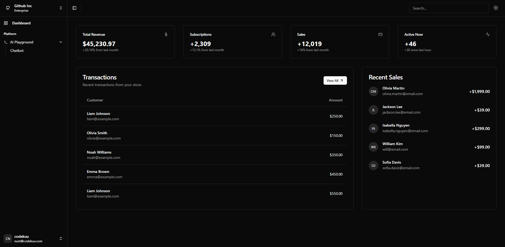
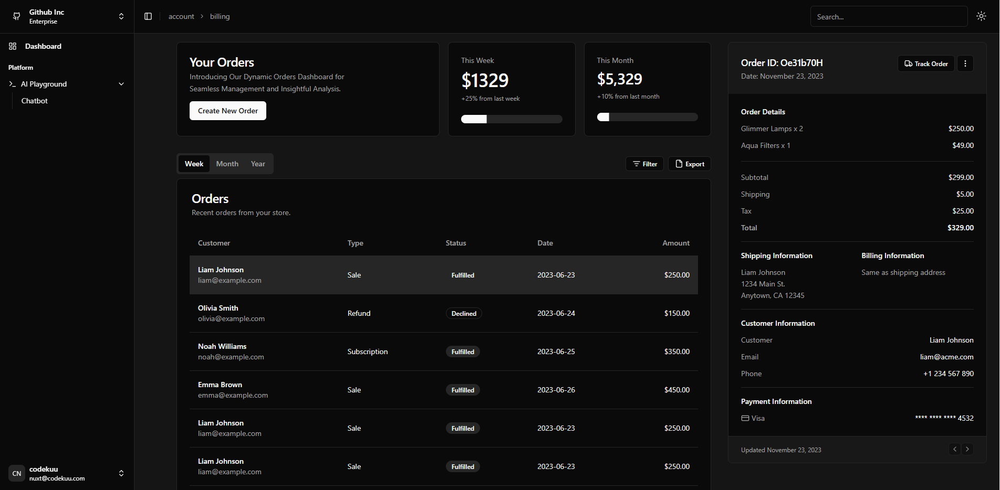

# Nuxt3 & vue-Shadcn & pinia & tailwindcss

Example project using Nuxt3 with shadcn-vue, pinia and tailwindcss.

Run it using npm, pnpm, yarn or bun. Settings on host and port can be changed in nuxt.config.ts.

## Table of Contents

- [Documentations](#documentations)
- [Example images](#example-images)
  - [Dashboard](#dashboard)
  - [Login](#login)
  - [Billing](#billing)
- [How to add components (shadcn)](#how-to-add-components-shadcn)
- [Setup](#setup)
- [Development Server](#development-server)
- [Production](#production)

## Documentations

| Link                                                            | Description                                  |
| --------------------------------------------------------------- | -------------------------------------------- |
| [Nuxt3](https://nuxt.com/docs/getting-started/introduction)     | Nuxt3 is a progressive Vue framework         |
| [Vue3](https://vuejs.org/guide/introduction.html)               | Vue3 is a progressive JavaScript framework   |
| [Shadcn-vue](https://www.shadcn-vue.com/docs/introduction.html) | Shadcn-vue is a Vue3 component library       |
| [Pinia](https://pinia.vuejs.org/core-concepts/)                 | Pinia is a Vue3 store library                |
| [Tailwindcss](https://tailwindcss.com/docs)                     | Tailwindcss is a utility-first CSS framework |

## Example images

### Dashboard



### Login


### Billing



## How to add components (shadcn)

To add a new component we need to use npx:

```bash
npx shadcn-vue@latest add XXXXX
```

Read more about it here (step 9): https://www.shadcn-vue.com/docs/installation/nuxt.html

## Setup

Make sure to install dependencies:

```bash
# npm
npm install

# pnpm
pnpm install

# yarn
yarn install

# bun
bun install
```

## Development Server

Start the development server on `http://localhost:3000`:

```bash
# npm
npm run dev

# pnpm
pnpm dev

# yarn
yarn dev

# bun
bun run dev
```

## Production

Build the application for production:

```bash
# npm
npm run build

# pnpm
pnpm build

# yarn
yarn build

# bun
bun run build
```

Locally preview production build:

```bash
# npm
npm run preview

# pnpm
pnpm preview

# yarn
yarn preview

# bun
bun run preview
```

Check out the [deployment documentation](https://nuxt.com/docs/getting-started/deployment) for more information.
